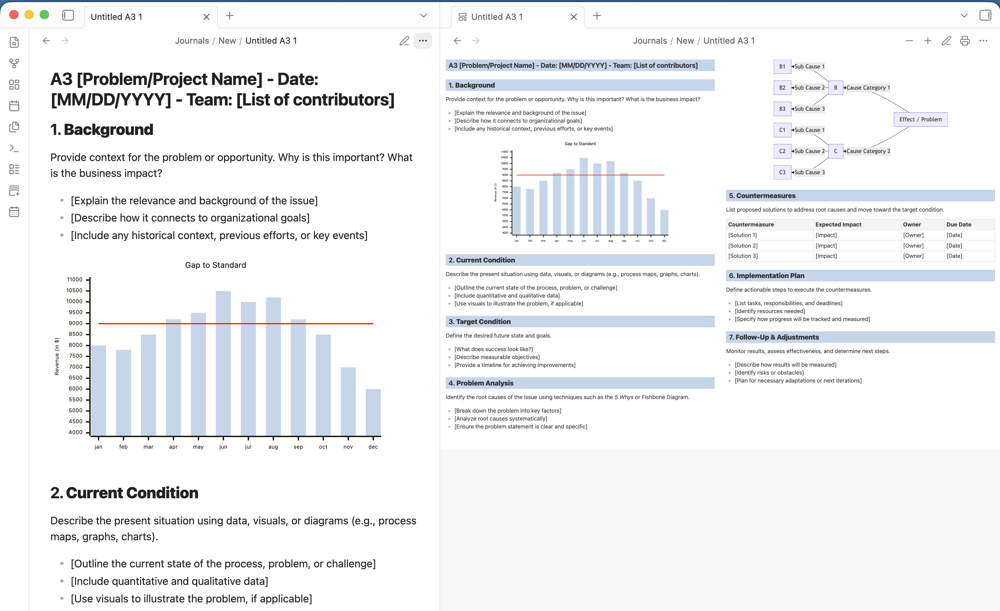

# A3 Problem-Solving (Obsidian plugin)

Renders markdown notes as a Toyota-style A3 problem-solving report (the format from "Managing to Learn"): a 42cm x 29.7cm two-column A3 landscape page, scaled to fit the pane, with mermaid diagrams.




A note gets three ways to look at it: Obsidian's Reading view, Source mode / Live Preview, and the plugin's **A3 view**.

## Usage

- **Toggle A3 view** (command palette): switch the active note between markdown and A3 view.
- **Open as A3**: right-click a markdown file in the file explorer, or use the editor context menu.
- **Create new A3** (command palette): create a note pre-filled with the A3 template and open it in A3 view.
- In A3 view, the tab header actions are:
  - **printer**: export the page as a standalone HTML file and open it in the browser, ready to print on A3 landscape paper;
  - **pencil**: switch back to markdown;
  - **+ / -**: adjust the page font size (7-13pt). Mermaid diagrams are re-rendered to match, so their boxes are laid out around the resized text.

## Why mermaid is bundled

The plugin ships its own copy of mermaid (which is most of the plugin's size) instead of using Obsidian's built-in mermaid pipeline. Obsidian bakes text measurements into the rendered SVG and caches it by diagram source text, so a font-size change never reaches the diagram layout. Rendering with a bundled mermaid, re-initialized with a font size scaled to the page's, is what makes the + / - font-size feature apply to diagrams and not just text.

## Development

```
npm install
npm run dev     # watch mode
npm run build   # type-check + production bundle
```

Install into a vault by symlinking this folder into the vault's plugin directory:

```
ln -s /path/to/obsidian-a3-plugin "/path/to/Vault/.obsidian/plugins/athree-problem-solving"
```

Then enable "A3 Problem-Solving" in Settings > Community plugins (toggle off Restricted mode if needed). After a rebuild, reload Obsidian (Cmd+R) or use the Hot Reload plugin.

## License

[MIT](LICENSE)
