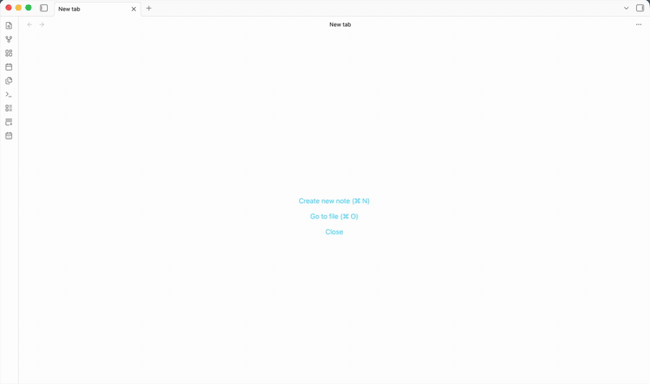

# A3 Problem-Solving (Obsidian plugin)

Renders markdown notes as a Toyota-style A3 problem-solving report (the format from "Managing to Learn"): a 42cm x 29.7cm two-column A3 landscape page, scaled to fit the pane, with mermaid diagrams.




A note gets three ways to look at it: Obsidian's Reading view, Source mode / Live Preview, and the plugin's **A3 view**.

## Usage

- **Toggle A3 view** (command palette): switch the active note between markdown and A3 view.
- **Open as A3**: right-click a markdown file in the file explorer, or use the editor context menu.
- **Create new A3** (command palette): create a note pre-filled with the A3 template and open it in A3 view.
- In A3 view, the tab header actions are:
  - **printer**: export the page as a standalone HTML file and open it in the browser, ready to print on A3 landscape paper;
  - **pencil**: switch back to markdown;
  - **+ / -**: adjust the page font size (7-13pt). Mermaid diagrams are re-rendered to match, so their boxes are laid out around the resized text.

## How notes are rendered

The A3 view renders the note with its own markdown renderer (markdown-it, shared with the [VS Code extension](../vscode) so both give the same page) rather than Obsidian's: CommonMark, tables, task lists, raw HTML (minus scripts), relative images from the vault, and fenced `mermaid` blocks. Obsidian-only syntax such as wikilinks, embeds and callouts is not rendered in A3 view.

The plugin ships its own copy of mermaid (which is most of the plugin's size) instead of using Obsidian's built-in mermaid pipeline. Obsidian bakes text measurements into the rendered SVG and caches it by diagram source text, so a font-size change never reaches the diagram layout. Rendering with a bundled mermaid, re-initialized with a font size scaled to the page's, is what makes the + / - font-size feature apply to diagrams and not just text.

## Development

From the repository root:

```
npm install
npm run dev:obsidian   # watch mode
npm run build          # type-check + production bundle (all packages)
```

The build writes `main.js` and `styles.css` into this folder (`packages/obsidian`). Install into a vault by symlinking it into the vault's plugin directory:

```
ln -s /path/to/vscode-obsidian-a3-plugin/packages/obsidian "/path/to/Vault/.obsidian/plugins/athree-problem-solving"
```

Then enable "A3 Problem-Solving" in Settings > Community plugins (toggle off Restricted mode if needed). After a rebuild, reload Obsidian (Cmd+R) or use the Hot Reload plugin.

## Credits

Diagrams are rendered by [mermaid](https://github.com/mermaid-js/mermaid) (MIT license, Copyright (c) 2014-present Knut Sveidqvist), which is bundled with the plugin. Markdown is rendered by [markdown-it](https://github.com/markdown-it/markdown-it) (MIT license).

## License

[MIT](LICENSE)
