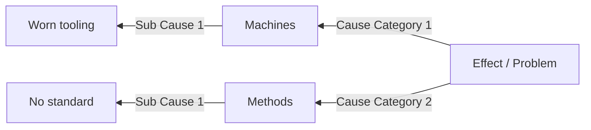

# A3 E2E Sample - Date: 01/01/2026 - Team: CI

## 1. **Background**
This note exists to exercise the plugin end to end.

- One mermaid diagram below must render with node boxes sized to the text
- The page must lay out in two columns at 42cm x 29.7cm

## 2. **Current Condition**
Plain text, a list, and a table:

| Countermeasure | Owner | Due Date |
|---------------|-------|---------|
| Fix the thing | CI    | 01/02/2026 |

## 3. **Target Condition**
All e2e scenarios pass.
